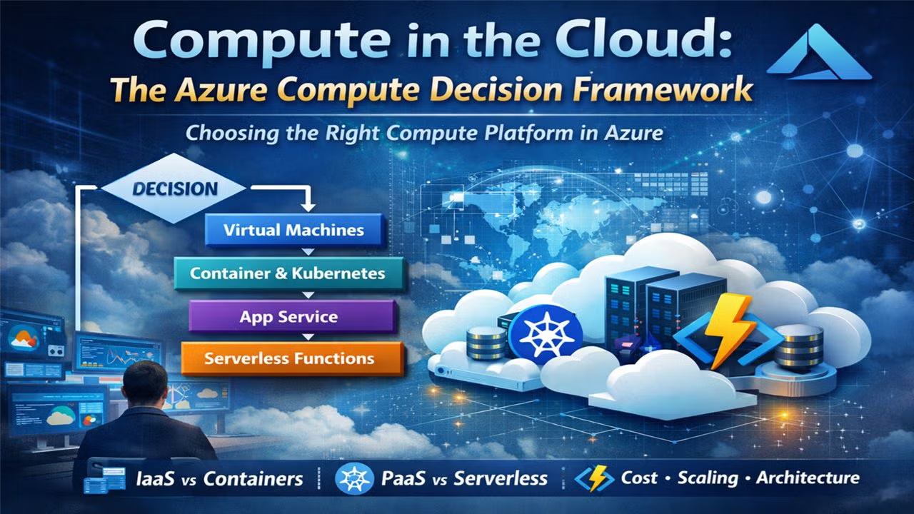
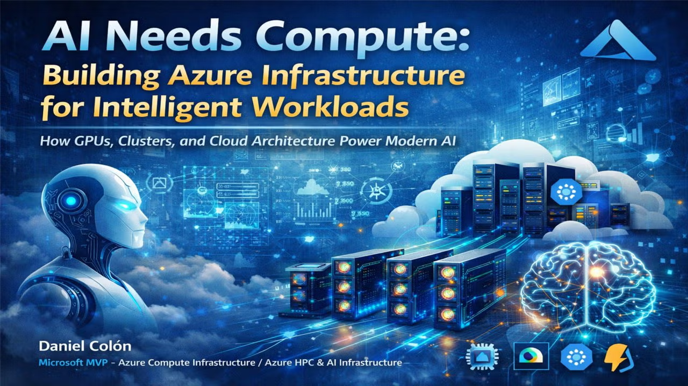
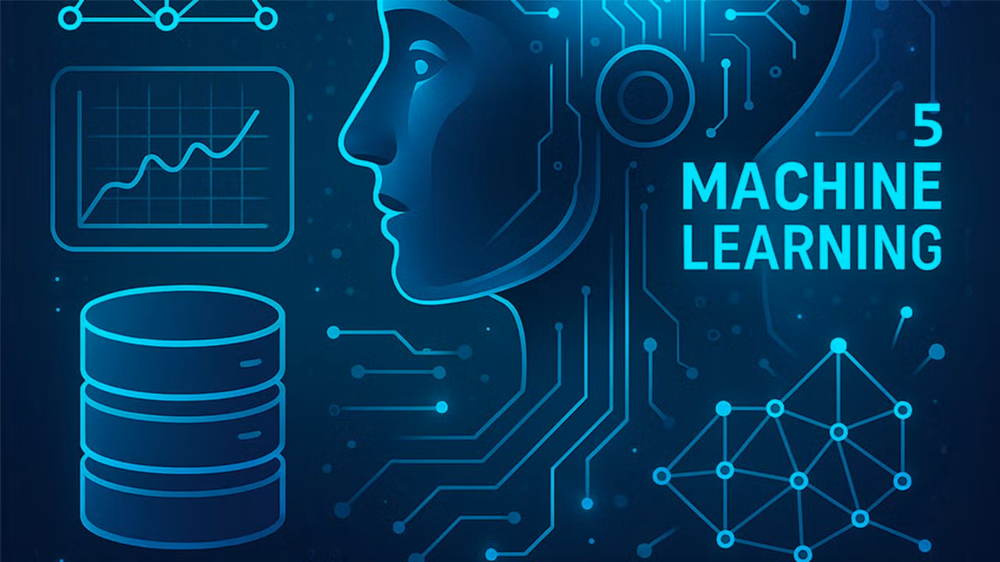

<!--## Hi there 👋-->

<!--
**danielecolon/danielecolon** is a ✨ _special_ ✨ repository because its `README.md` (this file) appears on your GitHub profile.

Here are some ideas to get you started:

- 🔭 I’m currently working on ...
- 🌱 I’m currently learning ...
- 👯 I’m looking to collaborate on ...
- 🤔 I’m looking for help with ...
- 💬 Ask me about ...
- 📫 How to reach me: ...
- 😄 Pronouns: ...
- ⚡ Fun fact: ...
-->
## Upcoming Presentations
<!--
### Compute in the Cloud 

- Monday, April 20th Compute in the Cloud - Cloud NH 
  https://www.meetup.com/cloudnh/events/313807300/ 
 

### AI Needs Compute

- Tuesday April 21st AI Needs Compute - Cloud TX 
  https://www.meetup.com/cloudtx/events/313808680/ 
 
-->

### Azure Machine Learning Series
  

- Wednesday, May 13 Azure Machine Learning 4 - Nashua CLOUD .NET User Group 
  https://www.meetup.com/nashuaug/events/313820144/ 
- Wednesday, Jun 10 Azure Machine Learning 5 - Nashua CLOUD .NET User Group 
  https://www.meetup.com/nashuaug/events/313820173/ 
