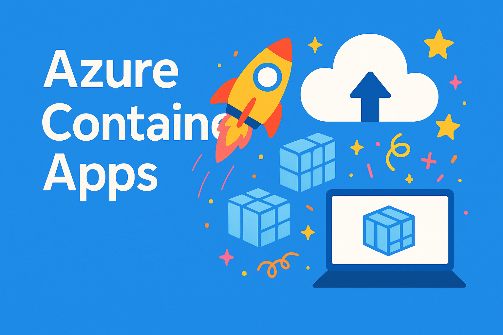

<!--## Hi there 👋-->

<!--
**danielecolon/danielecolon** is a ✨ _special_ ✨ repository because its `README.md` (this file) appears on your GitHub profile.

Here are some ideas to get you started:

- 🔭 I’m currently working on ...
- 🌱 I’m currently learning ...
- 👯 I’m looking to collaborate on ...
- 🤔 I’m looking for help with ...
- 💬 Ask me about ...
- 📫 How to reach me: ...
- 😄 Pronouns: ...
- ⚡ Fun fact: ...
-->
## Upcoming Presentations
<!--
### Compute in the Cloud 

- Monday, April 20th Compute in the Cloud - Cloud NH 
  https://www.meetup.com/cloudnh/events/313807300/ 
 

### AI Needs Compute

- Tuesday April 21st AI Needs Compute - Cloud TX 
  https://www.meetup.com/cloudtx/events/313808680/ 
 
-->

### Azure Machine Learning Series
 

- Wednesday, July 8th Azure Machine Learning 5 - Nashua CLOUD .NET User Group 
  https://www.meetup.com/nashuaug/events/313820173/ 

  
## 🎤 Past Presentations

### AI
-------
#### 🐧 Azure ML Series (WSL) 
Introduction to the core concepts of Azure Machine Learning, including workspaces, datasets, experiments, training, and model deployment.
📦 [GitHub](https://github.com/danielecolon/Azure-ML)
1. Overview
  - 📺 [YouTube](https://www.youtube.com/watch?v=vsuLHIVrzXo&t=1354s)
  - 💻 [Slides](https://github.com/danielecolon/Azure-ML/blob/main/1-Overview/AzureML_1-Overview.pdf)
2. Data & ETL
  - 📺 [YouTube](https://www.youtube.com/watch?v=YE9SgWjp6-E)
  - 💻 [Slides](https://github.com/danielecolon/Azure-ML/blob/main/2-Data_n_ETL/AzureML_2-Data_n_ETL.pdf)
3. Compute & Environments
  - 📺 [YouTube](https://www.youtube.com/watch?v=6tuItVwHH0E)
  - 💻 [Slides](https://github.com/danielecolon/Azure-ML/blob/main/3-Compute_n_Environments/3-Compute_n_Environments.pdf)
4. Modeling & Experimentation
  - 📺 [YouTube](https://www.youtube.com/watch?v=OG9njiEtTJE)
  - 💻 [Slides](https://github.com/danielecolon/Azure-ML/blob/main/4-Modeling_n_Experimentation/Modeling_n_Experimentation.pdf)
5. Deploying & Operating Models
  - 📺 [TBD]()
  - 💻 [TBD]()
6. Team Environment & EnterpriseGovernance
  - 📺 [TBD]()
  - 💻 [TBD]()
  
### CLI
-------
#### 🐧 Windows Subsystem for Linux (WSL) 
Learn how to use WSL for cloud engineering, development workflows, containers, and Linux tooling directly from Windows. 

- 📺 [YouTube](https://www.youtube.com/watch?v=vsuLHIVrzXo&t=1354s)
- 💻 [Slides](https://github.com/danielecolon/WSL/blob/main/WSL.pdf)
- 📦 [GitHub](https://github.com/danielecolon/WSL)
 

#### 💻 Azure CLI
Master Azure from the command line using the Azure CLI for automation, scripting, and infrastructure management.

- 📺 [YouTube](https://www.youtube.com/watch?v=_inJ4uKAJTc&t=1617s)
- 💻 [Slides](https://github.com/danielecolon/Azure-CLI/blob/main/AzureCLI(az).pdf)
- 📦 [GitHub](https://github.com/danielecolon/Azure-CLI)
 

### HPC
-------
#### ⚡ Azure Batch
An introduction to Azure Batch for large-scale parallel workloads, rendering, media processing, and HPC job scheduling.

- 📺 [YouTube](https://www.youtube.com/watch?v=-kvSgLiEdzQ)
- 💻 [Slides](https://github.com/danielecolon/Azure-Batch/blob/main/Azure%20HPC%20Batch.pdf)
- 📦 [GitHub](https://github.com/danielecolon/Azure-Batch)
 

#### 🧠 Azure CycleCloud
Explore Azure CycleCloud for deploying and managing HPC and AI clusters using Slurm and enterprise-scale schedulers.

- 📺 [YouTube](https://www.youtube.com/watch?v=hDXpCk9tZoc&t=1815s)
- 💻 [Slides](https://github.com/danielecolon/Azure-CycleCloud/blob/main/Azure%20HPC%20CycleCloud.pdf)
- 📦 [GitHub](https://github.com/danielecolon/Azure-CycleCloud)
 

### Containers
-------
#### 📦 Azure Container Apps
- 📦 [GitHub](https://github.com/danielecolon/Azure-ContainerApps)

Serverless container service that simplifies the deployment and management of modern applications and microservices.

- 📺 [YouTube: Intro](https://www.youtube.com/watch?v=2ug361lOkvQ&t=303s)
- 💻 [Slides: Intro](https://github.com/danielecolon/Azure-ContainerApps/blob/main/Azure%20Container%20Apps%20-%20Introduction.pdf)
- 📺 [YouTube: Adv](https://www.youtube.com/watch?v=NRhEvT7CSa4&t=649s)
- 💻 [Slides: Adv](https://github.com/danielecolon/Azure-ContainerApps/blob/main/Azure%20Container%20Apps%20-%20Advanced%20Features%20v2.pdf)
  

#### 📦 Run Ollama on Azure Container Apps
Build and deploy Ollama in a containerized environment using Azure Container Apps.                              

 
- 📺 [YouTube](https://www.youtube.com/watch?v=ApT7UjxE2bs&t=4042s)                                                   
- 💻 [Slides](https://github.com/danielecolon/Azure-ContainerApps-Ollama/blob/main/Self-Hosting%20AI%20LLMs.pdf)        
- 📦 [GitHub](https://github.com/danielecolon/Azure-ContainerApps-Ollama)                                            
 

